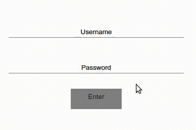

## CSTSI - AEI - 5SEM - Atividades Aula 01

Exercícios sobre as regraas e propriedades de transição com CSS3. Todos os exercícios devem ser feitos apenas com regras CSS, ou equivalentes como Sass e Styled Components.

1) Utilize a pseudo-classe *:hover* e *:focus* para aplicar transições nos elementos do formulário de login de acordo com os efeitos mostrados na figura abaixo:



Use a seguinte estrutura HTML:
```html
<div class="container">
        <div class="input-group">
            <label for="login">Username:</label>
            <input id="login" type="text" name="login" placeholder="Username">
        </div>
        <div class="input-group">
            <label for="password">Password:</label>
            <input id="password" type="password" name="login" placeholder="Password">
        </div>
        <div class="button-group">
            <button>Enter</button>
        </div>
    </div>
```

2) Desenvolva quatro diferentes efeitos de transição utilizando as regras CSS em botões, campos de formulários e/ou outros elementos de interface do seu projeto ***frontend***, pode ser do próprio **TCC**, ou de **semestres anteriores**.