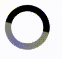
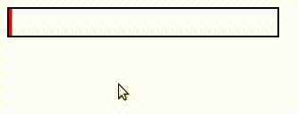

## CSTSI - AEI - 5SEM - Atividades Aula 02


1) Use a propriedade animation para criar uma animação de carregamento (loader) baseada no gif abaixo:



 Não há restrição quanto a tempo, tamanho, cores ou proporções, apens a ideia geral da animação, ou seja, um círculo animado com duas cores pelo menos. Mas não é para usar nenhum tipo de imagem, apenas estilização.


2)  Use a pseudo-classe :hover e a propriedade animation para criar uma animação baseada na anterior, mas que será executada somente quando o mouse estiver na área interna ao quadrado pontilhado, como mostra a figura abaixo:

 

3) Modifique o  *[exemplo 7](https://codepen.io/g1ll/pen/ExQMBgN)*, visto em aula, para que a animação se comporte como a imagem gif abaixo:


Ou seja, os objetos devem tocas as laterais quadrado.

4) Crie a animação de barra de carregamento (load bar) conforme a ilustração abaixo: 



5) Modifique o exemplo de sprites do duende (goblin) ajustando os valores para uma imagem dez vezes maior ([big-goblin](../aula02-css3-animations/img/goblin_big.png), e reproduza a animação da figura abaixo:


A animação não deverá estar em loop, até porque será preciso criar mais de uma animação e sincronizá-las.

Use esta imagem: [big-goblin](https://github.com/g1ll/cstsi-4sem-lpaw/blob/main/aula02-css3-animations/img/goblin_big.png) e esta estrutura HTML a seguir:

```html
<div class="container">
    <div class="goblin-down"></div>
    <div class="goblin-right"></div>
    <div class="goblin-up"></div>
    <div class="goblin-left"></div>
</div>
```
Obs: Não é para utilizar ***javascript***, e a animação não precisa estar em loop, como aparenta o gif de exemplo.

6) Use o último exemplo da aula, baseado em loader do tipo skeleton, e adapte para alguma página de conteúdo do seu projeto front-end. Aplique o loader em todo o conteúdo da página que é carregado dinamicamente via requisição, ou simule uma situação equivalente através da função javascript ***setTimeout***.


